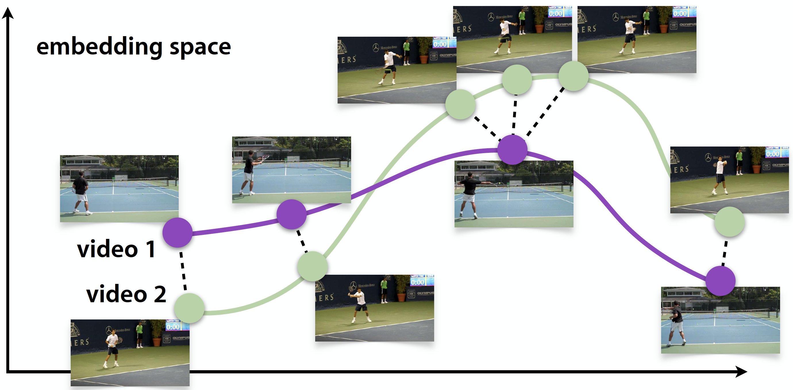
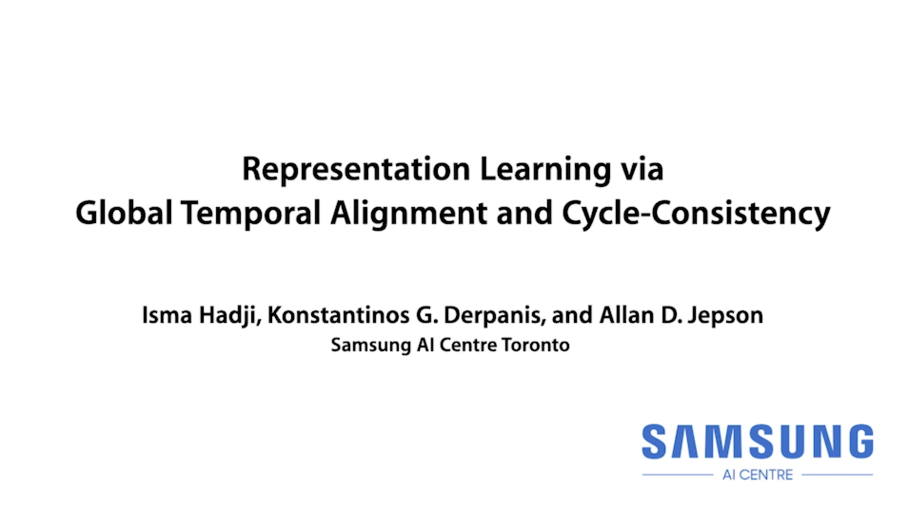

# Representation Learning via Global Temporal Alignment and Cycle-Consistency

*[Isma Hadji](http://www.cse.yorku.ca/~hadjisma/)*<sup>1</sup>, 
*[Konstantinos G. Derpanis](https://www.cs.ryerson.ca/kosta/)*<sup>1</sup>, 
and *[Allan D. Jepson](https://www.cs.toronto.edu/~jepson/)*<sup>1</sup>

<sup>1</sup>Samsung AI Center (SAIC) - Toronto &nbsp;&nbsp;
* This research was conducted at SAIC-Toronto, funded by Samsung Research, and a provisional patent application has been filed.


#
<div align="center">
  
</div>

This work introduces a representation learning approach based on (globally) aligning pairs of temporal sequences (e.g., video) depicting the same process (e.g., human action). Our training objective is to learn an element-wise embedding function that supports the alignment process.  For example, here we illustrate the alignment (denoted by black dashed lines) in the embedding space between videos of the same human action (i.e., tennis forehand) containing significant variations in their appearances and dynamics. Empirically,  we show that our learned embeddings are sensitive to both human pose and fine-grained temporal distinctions, while being invariant to appearance, camera viewpoint, and background.

## Applications
The proposed alignment loss enables various downstream applications. Take a look at this video for examples.
[](https://youtu.be/M_9bf60gQVQ)

## Code
This repo provides implementation of:

* Our proposed loss functions.
* A simple training code around our loss.
* A sample evaluation code for the alignment task using the Kendall's Tau metric.

- We provide here examples using the publicly available PennAction dataset: http://dreamdragon.github.io/PennAction/.
- We provide a model trained with our complete loss on all classes of the PennAction dataset in this repo under the `saved_models/Penn_Action_SmoothDTW_CYCLE_CONSIST` folder.


### Requirements
To run the code create a conda environment with packages provided in requirements.txt:
* `conda create --channel conda-forge --name learningFromAlignement python=3.6.9`
* `conda activate learningFromAlignement`
* `conda install --file requirements.txt`

If you get an error about dtw and opencv-python
* Delete (or comment out) dtw and opencv-python from requirements.txt and do:
* `pip install dtw`
* `pip install opencv-python`
* `conda install --file requirements.txt`

### Our loss
Our main code and models is released under the Attribution-NonCommercial-ShareAlike 4.0 International  License.
* All code relevant to our loss (i.e. main contribution) is provided under `smoothDTW.py`
* We also provide a standalone demo for using our alignment method under `smoothDTW_demo.py`.

### Training
To train the backbone architecture used in our paper with our SmoothDTW loss and Global Cycle Consistency loss, simply run:
* `python train.py`
* If you want to use different parts of the loss or change training settings, simply modify the `config.py`.

### Evaluation
Here we provide a sample evaluation procedure for the synchronization task on the PennAction dataset. To get Kendall's Tau results, simply run:
* `python evaluate_KT.py --logdir /path/to/trained/model/`
* Note that a useful function for framewise feature extraction is provided under `utils.py`

## Citation
If you use this code or our models, please cite our paper:
```
@inproceedings{hadji2020,
  title={Representation Learning via Global Temporal Alignment and Cycle-Consistency},
  author={Hadji, Isma and Derpanis, Konstantinos G and Jepson, Allan D},
  booktitle={Proceedings of the IEEE Conference on Computer Vision and Pattern Recognition},
  year={2021}
}
```

## Acknowledgment
The data processing, loading and training setup code was modified from this very useful repo:
https://github.com/google-research/google-research/tree/master/tcc
